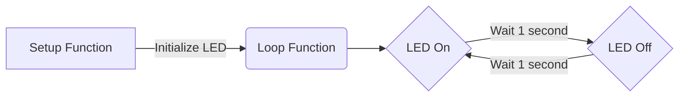

# Blink on board LED (Arduino)

This example demonstrates how to blink an on-board LED using an Arduino. It's a basic example to illustrate digital output control.

## Requirements and Setup

- Hardware: doppler board
- Software: Arduino Software



## Code

```c
void setup() {
  pinMode(LED_BUILTIN, OUTPUT); // Initialize the LED pin as an output
}

void loop() {
  digitalWrite(LED_BUILTIN, HIGH); // Turn the LED on
  delay(1000);                     // Wait for a second
  digitalWrite(LED_BUILTIN, LOW);  // Turn the LED off
  delay(1000);                     // Wait for a second
}
```

Certainly, here's an extended explanation for each function in the Arduino code:

1. **The `setup` Function:**
   - Purpose: This function is called once when the Arduino first starts up or is reset. It's used for initial setup procedures.
   - In Your Code: Configures the LED pin as an output. This is done by the line `pinMode(LED_BUILTIN, OUTPUT);`, which sets the built-in LED pin to behave as an output.

2. **The `loop` Function:**
   - Purpose: This function continuously runs after the `setup` function has completed. It contains the main logic that the Arduino repeatedly executes.
   - In Your Code: 
     - Turns the LED on using `digitalWrite(LED_BUILTIN, HIGH);`. This sends a high voltage to the built-in LED, lighting it up.
     - Pauses for one second with `delay(1000);`. This keeps the LED on for one second.
     - Turns the LED off with `digitalWrite(LED_BUILTIN, LOW);`. This stops the voltage to the LED, turning it off.
     - Again pauses for one second with `delay(1000);`. This keeps the LED off for one second.

3. **The `pinMode` Function:**
   - Purpose: Sets a specified digital pin to behave either as an input or an output.
   - In Your Code: It's used in the `setup` function with the syntax `pinMode(LED_BUILTIN, OUTPUT);` to set the built-in LED pin as an output.

4. **The `digitalWrite` Function:**
   - Purpose: Writes a HIGH or LOW value to a digital pin.
   - In Your Code: 
     - `digitalWrite(LED_BUILTIN, HIGH);` turns the LED on by setting the voltage at the LED pin high.
     - `digitalWrite(LED_BUILTIN, LOW);` turns the LED off by setting the voltage at the LED pin low.

5. **The `delay` Function:**
   - Purpose: Pauses the program for the amount of time (in milliseconds) specified as a parameter.
   - In Your Code: Used twice in the loop function with `delay(1000);` to create a one-second pause between turning the LED on and off.

Each of these functions plays a critical role in controlling the behavior of the Arduino and its connected components. In your blinking LED example, they work together to create a simple yet effective demonstration of digital output control.

When this code runs, the on-board LED should blink on and off every second. This example is fundamental in understanding how to control digital outputs on an Arduino board.